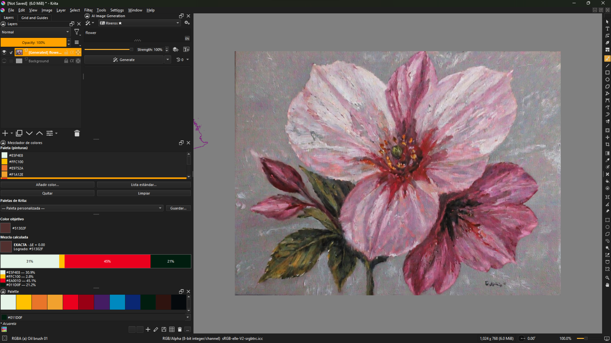

# color_mixer

Plugin para Krita que calcula la mezcla de tu paleta que mejor iguala un color objetivo.

## Funcionamiento

- **Paleta**: añade colores con el selector, desde la lista estándar (200+ colores) o importa una paleta de Krita. Se guarda entre sesiones.
- **Guardar paleta**: el botón «Guardar...» escribe la paleta actual como paleta de Krita (`%APPDATA%\krita\palettes`) y la añade a la lista de paletas, disponible también en Krita.
- **Color objetivo**: recoge un color con el gotero de Krita (o Ctrl+clic con un pincel); el plugin detecta automáticamente el color frontal y calcula la mezcla.
- **Resultado**: fórmula con porcentajes, barra visual de proporciones, color logrado y ΔE CIEDE2000 (EXACTA si ΔE ≤ 0.5, APROXIMADA en caso contrario). El modelo usa mezcla de pigmentos Kubelka-Munk con reflectancia acotada al rango físico de la pintura.

## Instalación

1. Copia la carpeta `color_mixer` a `%APPDATA%\krita\pykrita\color_mixer`.
2. Copia `color_mixer.desktop` a la raíz de `%APPDATA%\krita\pykrita\`.
3. Reinicia Krita: Configurar Krita → Gestor de plugins Python → activa "Mezclador de colores".
4. Muéstralo en Configurar Krita → Ventanas acoplables → "Mezclador de colores" (persiste con el espacio de trabajo).

## Licencia

MIT — ver `LICENSE`.
